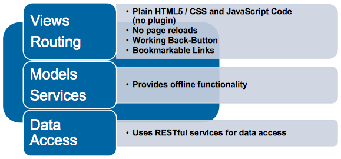
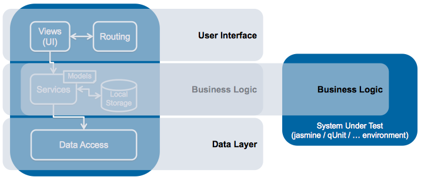
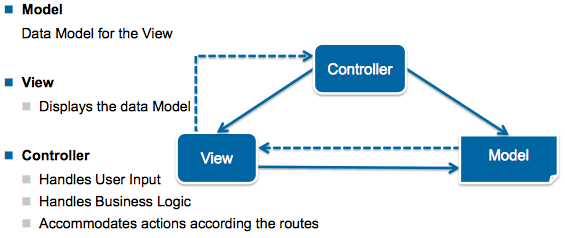

# SPA

## Goals

Die Teilnehmer können:

- den Einsatz einer SPA für ein Projekt evaluieren
- das MVC Konzept in einer SPA einsetzen
- die Hauptkomponenten wie Routing, Module, Services, Data Access einer SPA selbst implementieren
- eine mehrschichtige SPA-Architektur erstellen
- die wichtigsten Konzepte des Bundlings mit WebPack erläutern
- erweiterte Konzepte wie Dependency Injection, Data Flow, Rendering mit eigenen Worten umschreiben

## Introduction

### Benefits

* No need for a client backup
* Platform independent
* No software update
* Lower investment costs
* Software can be provided as a Service (SaaS)
  * «pay as you go» (charges based on usage)

### Liabilities

* No data sovereignty
* Limited calibration possibilities
* Limited/restricted hardware access
* No operation system access
* More expensive deployment strategies
* (SEO compatibility)

## Characteristics I

* Plain HTML5 / CSS and JavaScript Code (no plugin)
* No page reloads
* Working Back-Button
* Bookmarkable Links
* Provides offline functionality
* Uses RESTful services for data access



## Architecture



### Layer Architecture with JS

```javascript
(function(ui) {
  // ui/controller logic
})(window.ui = window.ui || {});
```

```javascript
(function(bl) {
  // business logic
})(window.bl = window.bl || {});
```

```javascript
(function(dl) {
  // data access logic
})(window.dl = window.dl || {});
```

## Routing

* Links to multiple application parts together
  * to separate applications into cohesive parts
* Provides the concept of information architecture (IA)
  * You should define your IA before start thinking about routing

### Basic Principles

* Routing is accomplished completely on client-side
  * No page reload, no round-trip, server isn't involved
  * Page transition is completely managed by JS
  * Working back button and bookmarks
* Entry point [View (UI) Controller] is enforced by the given route
  * Controller provides features behind a View (UI) and bootstraps it
* Routes provides client-side event hooks during navigation
  * Lifecycle Management

### Concepts

* The old way: Using Anchors (`#`)
  * Anchors do not case a request to the server
  * But Anchors can be read out by the client using `window.location.hash` (e.g. `#/home/register`)
  * `window.onshashchange` can be used to liste for route changes
* The HTML5 Way
  * JavaScript API `window.history` is used
  * `window.history.pushState` causes the address bar to display a desired URL, BUT won't cause the browser to load it or even check that URL exists
  * `window.onpopstate` can be used to liste for route changes
  * Caution: Config adjustments needed on server-side (all sub-routes must return root-files)
* [Source](https://developer.mozilla.org/en-US/docs/Web/API/History_API)

### Example

```javascript
{
  rootPath: "/demo2/",
  initialRoute: "index",
  routes: {
    "index": () => { /*invoke index controller*/ },
    "welcome": () => { /* invoke welcome controller */ }   
  }
}
```

```javascript
class Router {
  constructor(routeConfig) {
    this.routeConfig = routeConfig
  }
  
  navigate(route) {
    // Push route into URL
    window.history.pushState(null, void 0, route);
    this.activate(route)
  }
  
  activate(route) {
    if (this.routeConfig.routes[route]) {
      // Activate controller for given route
      this.routeConfig.route[route]();
    }
  }
  
  initialize() {
    // get/parse route from URL (self.location.pathname)
    // to activate the user-entered route
    const activatedRoute = ...;
    this.activate(activatedRoute || this.routeConfig.initialRoute)
  }
}
```

## Views

* HTML should be separated from it's logic part (JS)
  * Provides better testability
  * Cleaner code, easier to understand in view and also logic parts
* Data for the View should be provided separately (Models)

### Model View Controller



### Example: Controller

```js
class CounterController {
  constructor() {
    this.indexTemplateCompiled = Handlebars.compile($('#index-view').html())
  }
  
  // Get's called by the Router
  // viewRef represents the render target
  indexAction(viewRef) {
    // Renders the initial (blank) state
    const model = new bl.CounterModel();
    this.renderIndexView(viewRef, model);
    // Live event registration within the given view
    $(viewRef).on("click", "[data-click=up]", /* update count property and re-render */);
  }
  
  renderIndexView(viewRef, model) {
    // renders the view accordint the index-view template
    viewRef.html(this.indexTemplateCompiled({ counter: model}));
  }
}
```

### Example: Integration

```js
// Enhanced bootstrapper code
// Initialize controllers and render target
const controller = new ui.CounterController();
const routerOutletView = $("#appContainer");

const router = new ui.Router({
  rootPath: "/demo/",
  initialRoute: "index",
  routes: {
    // Forward invocation from route 
    // to the corresponding controller and action
    "index": () => { controller.indexAction(routerOutletView); }
  }
})
```

## Services

* They contain major application logic
  * This may be either business or general core logic
* They are generally the source of all application data (Data Services)
  * Interact with the data resources in an async manner
  * May provide facilities to cache the data locally on the client
* Provide micro testing of smallest possible logic units
* Completely decoupled from UI
  * Communication is based on inderctions
* UI Services are often seen in the communication between the UI Controllers

### Communication Concepts

There are several concept how data services can be wired with the UI

* Flux/Redux, data flow approach mostly used with the React library
* Reactive Patterns, streaming based approach used by Angular2
* Other patterns, such as Observer Pattern

### Example

```js
class CounterService {
  // Provides an async interface for calling external resources
  load(callback) {
    callback(CounterModel.fromDto(dto));
  }
  
  up(callback) {
    // DTO will be received from the server and converted to a model
    callback(CounterModel.fromDto(dto));
  }
}
```

```js
class CounterController {
  // Service is provided as constructo argument
  constructor(counterService) {
    this.counterService = counterService;
    this.indexTemplateCompiled = Handlebars.compile($("#index-view").html());
  }
  
  indexAction(viewRef) {
    // Renders the initial state based on the underlying service
    this.counterService.load((model) => {
      this.renderIndexView(viewRef, model);
    });
    $(viewRef).on("click", "[data-click=up]", (e) => {
      this.counterService.up((model) => {
        this.renderIndexView(viewRef, model);
      })
      e.preventDefault;
    })
  }
}
```

### Advanced: Local Storage

* Browser can store (cache) data in string format into the local storage
* Provides an easy API to store and retrieve string values directly on the clinet
  * Data has no expiration time
  * Values are shared across every window or tab running at the same origin
  * The max size depends on the browser implementation (5 - 25MB)
* API Example
  * `localStorage.setItem("lastname", "Smith");`
  * `localStorage.getItem("lastname");`
* Other storage mechanisms such as [Web SQL](https://developer.mozilla.org/en-US/docs/Mozilla/Tech/XPCOM/Storage) are also available

## Data Access

### Components

* Data Access components are used to encapsulate the communication protocol
* Allow flexible replacement if format of external service changes
* Testing of logic services can be accomplished without knowledge of the underlying protocols
  * by faking the Data Access components
  * This leads to more stable tests
* Contain logic to establish the communication channel
  * Send/receive DTOs (Data Transfer Objects), often as JSON
* Represent a kind of «data drivers»

### Example

```js
class CounterDataResource {
  // Create GET request and load data from host
  get(callback) {
    $.get("/api", (data) => {
      callback(data);
    });
  }
  
  // Create POST request and change data on host
  postUp(callback) {
    $.post("/api/up", (data) => {
      callback(data);
    })
  }
}
```

```js
class CounterService {
  constructor(counterDataResource) {
    this.counterDataResource = counterDataResource;
  }
  
  load(callback) {
    // Forward GET request to underlying data access component
    this.counterDataResource.get((dto) => {
      callback(CounterModel.fromDto(dto));
    })
  }
  
  up(callback) {
    // Forward POST request to underlying data access component
    this.counterDataResource.postUp((dto) => {
      callback(CounterModel.fromDto(dto));
    })
  }
}
```

## Dependency Injection

### Benefits

* Reduces coupling between consumer and implementation
* The contracts between the classes are based on interfaces
  * Classes relate to each other not directly, but mediated by their interfaces
* Supports the open/closed principle
* Allows flexible replacement of an implementation

### Example

```js
class Container {
  retister(name, dependencies, type) {
    // Registers a new object within the container
    // Objects are identified by name
    this.registrations[name] = { name, dependencies, type, instance: null };
  }
  
  resolve(name) {
    if (!this.registrations[name].instance) {
      // Ensure the requested object exists
      // Otherwise create it (lazy loading)
      this.registrations[name].instance = 
        // Call resolve() for all dependent objects
        new this.registrations[name].type(...this.resolveDependencies(name));
    }
    return this.registrations[name].instance;
  }
}

// Creates a new global object of the DI container
di.container = new Container();
```

```js
class CounterService {
  // ...
}

// Register the CounterService class with a relation to the CounterDataResource.
// This Object is required to instantiate the CounterService

di.container.register("CounterService", ["CounterDataResource"], CounterService);
                                        // ^^ Specifies a dependent instance

// Resolves the CounterService with all dependencies and returns the CounterService instance
di.resolve("CounterService");
```

## Bundling SPAs

* All JS code must be delivered to the client over potentially metered/slow networks
* Bundling and minifying the source code leads to smaller SPA footprint
* Larger SPAs with many modules need a reliable dependency management
* Initial footprint can be reduced by loading dependent modules on-demand

### WebPack as Bundler: Concepts

* Entry Point
  * The Entry point tells webpack where to start and follows the graph of dependencies to know what to bundle
* Output
  * Tell webpack where to bundle your application
* Loaders
  * Loaders in webpack transform these files into modules as the are added to your dependency graph
* Plugins
  * Loaders only execute transformations on a per-file basis, plugins are most commonly used performing actions and custom functionality

### Example

```
{
  // The base directory to resolve the entry
  context: rootDir,
  
  // Entry point files (modules to be bundled)
  entry: {
    di: srcDir + scriptsDir + "/di.js",
    ui: srcDir + scriptsDir + "/ui.js",
    bl: srcDir + scriptsDir + "/bl.js",
    dl: srcDir + scriptsDir + "/dl.js"
  },
  
  output: {
    // File path for the bundled output
    path: distDir + scriptsDir,
    // [name] means we are going to use the "key" value of each entry as the bundle file name
    filename: "[name].js"
  },
  
  module: {
    loaders: [
      {
        test: /\.js$/,
        exclude: /(node_modules|tmp)/,
        // Transpile ES6 to ES5 because of browser compatibility
        loader: "babel-loader"
      }
    ],
  },
  
  plugins: [
    // Copy index file to outut directory (this plugin also provides template rendering, versioning, ...)
    new HtmlWebpackPlugin({
      title: "Index",
      filename: "/index.html",
      template: srcDir + "/index.html"
    }),
    new webpack.optimize.UglifyJsPlugin({
      // Minify and uglify ES5 code
      compress: { warnings: false }
    })
  ]
}
```

## Conclusion

* Frontend Development is getting more complex
  * Many patterns and idioms are involved
  * Maintainability / testability must be ensured
  * Similar architectural approach such as seen in desktop applications
    * but in a more volatile/faster changing environment
  * Modern development concepts/tools required to handle that complexity
* Backward-compatibility for old browser should be ensured
  * Requires pre-compliation, polyfills, heavy-weight and sophisticated technology stacks
* Frameworks such as Angular and React are designed to fill this gap

## Sources

* http://codecamper.azurewebsites.net/#/sessions
* https://en.wikipedia.org/wiki/Single-page_application
* https://developer.mozilla.org/en-US/docs/Web/API/History_API
* https://www.heise.de/developer/artikel/Single-Page-Anwendungen-Framework-unabhaengig-entwickeln-3633930.html
* http://code.hootsuite.com/webpack-101