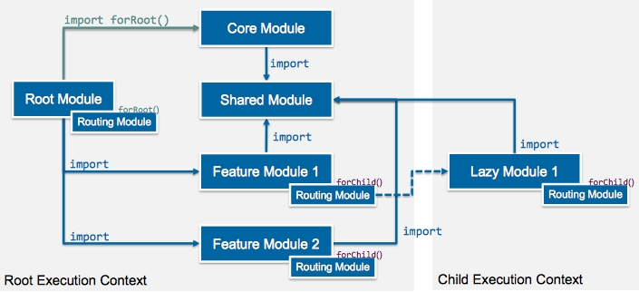

# Angular

## Goals

Die Teilnehmer können ...

* die Angular CLI für neue Blueprints sowie fürs Entwickeln verwenden
* Module entsprechend ihrer Funktionalität anlegen
* globale Services, welche garantiert nur einmal existieren, erstellen
* die Angular zugrunde liegenden Templating Prinzipien wie Binding, Interpolation, Directives anwenden
* Komponenten, Services, Templates erstellen und in einem Projekt einsetzen


* Komponenten verschachteln und die Komponenten mit konfigurierbaren Templates implementieren
* das Angular Life Cycle Management der Komponenten anwenden
* Data Resources Services anlegen und asynchrone HTTP Abfragen mit Angular absetzen
* HTTP Headers modifizieren um eigene authorization Information in den HTTP Request einzubinden
* die RxJS Extensions von Angular einsetzen
* die Forms-Komponenten/Direktiven von Angular anwenden und eigene Validators erstellen
* das Routing mittels Feature Routing Modules für eagerly loaded Feature- sowie Lazy Modules (inklusive Guards) implementieren

## Architectural Overview

* Modules
  * A cohesive block of code dedicated to closely related set of capabilities
* Directives
  * Provides instructions to transform the DOM
* Components
  * A component is a directive-with-a-template; it controls a section of the view
* Templates
  * A template is a form of HTML that tells Angular how to render the component
* Metadata
  * Metadata describes a class and tells Angular how to process it
* Services
  * Provide logic of any value, function, or feature that your application needs

## Modules

* Base for Angular modularity system
* Every app has at least one Angular module, the *root* Module
  * To bootstrap an Angular application, the root Module is launched
* Encapsulate cohesive blocks of code dedicated to a closely related set of capabilities
* Behave differently to JavaScript (ES6) modules
  * Each file represents exactly one module
  * An Angular module is a logical block of multiple ES6 modules linked together
* Modules export features (directives, services, …) required by other modules

### Module Declaration

```js
@NgModule({
  imports: [
    CommonModule
  ],
  declarations: []
})
export clas CoreModule { }
```

* `declarations: [Type1, Type2, …]`
  * The view classes that belong to this module
  * Angular has three kinds of view classes: Components, Directives and Pipes
* `exports: [Type1, Type2, …, Module1, Module2, …]`
  * The subset of declarations that should be visible and usable in the component templates of other modules
  * Can be re-export other modules, which are automatically included when importing this module
* `imports: [Module1, Module2, …]`
  * Specifies the modules which exports/providers should be imported to this module
* `providers: [Provider1, Provider2, …]`
  * Creaters of services that this module contributes to the global collection of services (Dependency Injection Container); they become accessible in all parts of the app
* `bootstrap: [Component]`
  * The main application view, called the root component
  * Only the root module should set this property

### Imports

#### Default Import

```typescript
@NgModule({ imports: [ForeignModule] })
```

* Imports all Components, Pipes, Directives from the given Foreign Module (by `exports` property)
  * Declarations will be re-instantiated on the current module level
* Providers are registered into the current DI container, if registration not yet made

#### [forChild Import](https://angular.io/guide/ngmodule)

```typescript
@NgModule({ imports: [ForeignModule.forChild({ })] })
```

* `forChild(config?)` represents a static method on a module class (by convention)
  * It returns an object with a `providers` property and a `ngModule` property
* It's nearly the same as a default import
  * but allows you to configure services for the current Module level

#### [forRoot Import](https://angular.io/guide/ngmodule#core-for-root)

```typescript
@NgModule({ imports: [ForeignModule.forRoot({ })] })
```

* `forRoot(config?)` represents a static method on a module (by convention)
  * It returns an object with a `providers` property and an `ngModule` property
* It provides and configures services at the same time
* Intention: Exclude a provider from the Module declaration and add it directly on root level instead
  * Enforces that the same provider won't be loaded twice by lazy modules
* **Only Root Modules (App Module) should import foreign Modules by calling `forRoot()`**
* **Declare your providers in `@NgModule` declaration OR in `forRoot()` definition but NEVER in both**
* When importing the forRoot() procedure on AppModule level ...
  * the providers are added to the DI container on root level
  * also the other ForeignModule properties are imported by the `ngModule` property
* But providers from `ForeignModule.forRoot()` takes precedence over the providers of module definition

```typescript
// Declare providers in Module declaration
// OR in forRoot() definition
@NgModule({ ... })
export class CoreModule {
  static forRoot(config?: {}): ModuleWithProviders {
    return {
      // Module declaration is also returned
      ngModule: CoreModule,
      providers: [
        // Services, Factories, ... 
        // to be used globally 
        // and instantiated exactly once
        GlobalService
        // Angular accumulates all forRoot() providers before
        // appending the providers listed in @NgModule.providers
      ]
    };
  }
}
```

```typescript
@NgModule({
  declarations: [AppComponent],
  imports: [CoreModule.forRoot()],
  providers: [/* from forRoot().providers */],
  bootstrap: [AppComponent]
})
export class AppModule { }
```

### Module Types

| Type                          | Description                              |
| ----------------------------- | ---------------------------------------- |
| **Root Module**               | Provides the entry point (bootstrap component) for the app |
| **Feature Module**            | Specifies clear boundaries between the application features |
| **(Feature-) Routing Module** | Specifies the routing specific configuration settings of the Feature (or Root Module) |
| **Shared Module**             | Holds the common components/directives/pipes and shares them with the modules that need them |
| **Core Module**               | Keeps your Root Module clean. Contains components/directives/pipes used by the Root Module. Additionally, globally used services can be declared here |
| **Lazy Modules**              | Represents lazily loaded Feature Modules |

#### Big Picture



### Root Module

* Provides the main view, called the root component, that hosts all other app views
* A root module has no reason to export anything
* By convention named AppModule and exists in a file named app.module.ts
* Imports BorwserModule, which every browser app must import
  * Registers critical application service providers and includes common directives
* Is bootstrapped by the main.ts
  * Accomplished according to the used compilation mechanism (dynamic/AOT)

### Core Module

* Provides globally required services
  * and components directly needed by the Root Module
* The core module should help to keep the Root Module clean
* Only the Root Module should import the Core Module
  * Calling it in any other module, particularly in a lazy-loaded module, is contrary to the intent and can produce a runtime error
  * Guard against a duplicated import and fail fast by adding the following CoreModule constructor

```typescript
constructor(@Optional() @SkipSelf() parentModule: CoreModule) {
  if (parentModule) {
    throw new Errror("CoreModule is already loaded. Import it in the AppModule only");
  }
}
```

### Shared Module

* Provides globally used components/directives/pipes
* It's a global UI component module
  * The provided features may also be required by other Angular projects
* Do not specify app-wide singleton providers (services) in a shared module
  * A lazy-loaded module that imports that shared module makes its own copy of the service
  * Specify those providers in the Root Module instead

### Feature Module

* Splits the application into cohesive feature sets
* Allows to assign development responsibilities to different teams
* Feature modules are designed to extend the app
* A feature module can expose or hide it's implementation from other modules
* Generally provides features of the application business domain, user workflow, facility (forms, http, routing), or collection of related utilities

### Lazy Module

* Provides similar features such as Feature Modules
  * Reduces the initial footprint of your SPA
* Are loaded lazily, when invoked by a lazy Route
  * Is strongly coupled to the Router - we will discuss this mechanism in a later lecture
* Angular creates a lazy-loaded module with it's own Dependency Injection container
  * A child of the root injector
  * Required because the Root DI container mustn't be modified after the initialization
* May cause some strange behaviour if `forRoot()` rules are violated

### Metadata Scope


## Directives

* Similar to a component, but without a template
* Declared as a TypeScript class with an @Directive() function decorator
* Two different kinds of directives exist:
  * Structural directives: Modifies the structure of your DOM
  * Attribute directives: Alter the appearance or behavior of an existing element

### Attribute Directives

* Changes the appearance or behavior of an element, component, or another directive
* Applied to a host element as an attribute

#### Example

NgStyle Directive: Sets the inline styles dynamically, based on the state of the component

```html
<div [style.font-size]="isSpecial ? 'x-large' : 'smaller'">
  <!-- render element -->
</div>
```

NgClass Directive: Bind to the ngClass directive to add or remove several classes simultaneously

```html
<div [class.secial]="isSpecial">
  <!-- render element -->
</div>
```

### Structural Directives

* Responsible for HTML layout
* Reshape the DOM's structure, typically by adding, removing, or manipulating elements
* Applied to a host element as an attribute
* An asteriks (*) precedes the directive attribute name

#### Example

NgIf Directive: Takes a boolean value and makes an entire chunk of the DOM appear or disappear

```html
<div *ngIf="hasTitle">
  <!-- shown if title available -->
</div>
```

NgFor Directive: Represents a way to present a list of items

```html
<li *ngFor="let element of elements">
  <!-- render element -->
</li>
```

#### Behind the scenes

* Asteriks is *syntactic sugar* for something a bit more complicated
* Angular *de-sugars* it in two stages
  * It translates the *directive="…" into a template attribute, template="directive ..."
  * Then it translates the template="…" attribute into a <template element
  * Example
    * `<div *ngIf="hasTitle"><!-- conditional content --><div>`
  * … results in
    * `<template [ngIf]="hasTitle"><div><!-- conditional content --></template>`
* Tempplate Syntax can be used, if an additional container tag should be avoided
  * `<template [ngIf]="hasTitle"><!-- conditional content --></template>`
* Keep in mind: None of these forms are actually rendered
  * Only the finished product ends up in the DOM

#### Example: Validation Directive

```typescript
@Directive({
  selector: "[validateEqual][ngModel]",
  providers: [{
    provide: NG_VALIDATORS,
    useExisting: forwardRef(() => EqualValidator),
    multi: true
  }]
})
export class EqualValidator implements Validator {
  @Input() public validateEqual: string;
  
  validate({value: modelValue}: AbstractControl): {[key: string]: any} {
    if (modelValue !== this.validateEqual) {
      return { validateEqual: false };
    }
    return null;
  }
}
```

## Managing Components

### Component Lifecycle

* Componentts underlie a life cycle
* Developers can tap into key moments in that lifecycle
  * Most important events are
    * Create `ngOnInit`
    * Destroy `ngOnDestroy`
  * `ngAfter…` events are mainly for control developers to handle sub-components and their DOM
* To hook into a lifecycle, interfaces of the Angular core can be implemented
  * Each interface has a single hook method, prefixed with ng
    * e.g. interface `OnInit` contains method `ngOnInit`
  * Angular only calls hook methods
    * Interfaces will be erased by the TS compiler


#### Creation and Destruction

* ngOnInit - the creation event (also known as hydration)
  * API: Initialize the directive/component after Angular first displays the data-bound properties
  * Setup the component and initially fetch data from an underlying data source
* ngOnDestroy - the destruction event (also known as dehydration)
  * API: Cleanup just before Angular destroys the directive/component
  * Use this method to detach event handlers to avoid memory leaks

##### Example

```typescript
@Component({
  ...
})
export class CounterComponent implements OnInit, OnDestroy {
  ngOnInit() {
    console.log("OnInit");
  }
  
  ngOnDestroy() {
    console.log("OnDestroy");
  }
}
```

## Services

* Services contain major application logic
* Interact with the data resources in an async manner
* May provide facilities to cache the data locally on the client
* There are several concepts how data services can be wired with the UI

### How Services Communicate with the UI

* Angular provides many features in conjunction with RxJS
  * This is the common approach when accessing data by the HTTP client (DataResource layer, lowest layer)
  * It's also possible, to pull RxJS through all layers (UI/Service/Data Resource)
  * … in the end, will result in async sections within the UI
* To reduce overall SPA complexity, the RxJS approach should only be used if really needed
  * There are well-known use cases to provide streaming-based data
    * Newstickers, Chats, Stock-Info Panels
  * Often, there is no need to handle data «as stream»
  * When UI needs to be updated, a simple UI invoke by an event may already be sufficient
* A more intuitive way is using the *EventEmitter*

#### Example

``` typescript
@Injectable
export class SampleService {
  private samples: SampleModel[] = []; // simple cache
  // Create emitter instance
  // The type of argument specifies the kind of object
  // to be passed on the subscriber
  public samplesChanged: EventEmitter<SampleModel[]> = 
    new EventEmitter<SampleModel[]>();
  
  constructor(/* Inject data resource service */) { }
  
  load(): void {
    // In real world app, invoke data resource service here
    this.samples = [new SampleModel()];
    // Logic to execute whwn data is ready
    // Emit changed event to notify the registrats (e.g. UI components)
    this.samplesChanged.emit(this.samples);
  }
}
export class SampleModel { ... }
```

``` typescript
@Component({})
export class SampleComponent implements OnInit, OnDestroy {
  private samples: SampleModel[];
  // Subscription is used to unsubscribe
  // the update event when the component is de-hydrated
  private samplesSubscription: Subscription;

  constructor(private sampleService: SampleService) { }

  ngOnInit() {
    // Register samplesChanged event on underlying business service
    // when componentn is hydrated.
    // .subscribe() returns a subscription which is used for dregistration
    this.sampleSubscription = this.sampleService.samplesChanged
      .subscribe((data: SampleModel[]) => { 
      	// Update procedure
        // Refresh Data on the UI level
        this.samples = data;
      });
  }

  ngOnDestroy() {
    // Unsubscribe the update event when the component is de-hydrated
    this.sampleSubscription.unsubscribe();
  }
}
```

## Data Access

* Angular HTTP Client implements asynchronisms by using the RxJS library
  * Endorsed by Angular, RXJS is a 3rd party library that implements the [Observable pattern](https://www.youtube.com/watch?v=VLGCCpOWFFw)
  * RxJS provides additional operators (e.g. map, catch, share, ...)

### HTTP Client API with Observables

* Think of an Observable as a stream
  * To listen for events in the stream, subscribe to the Observable
* Hot Observables
  * Sequence of events (such as mouse move events or stock tickers)
  * Shared among all subscribers
* Cold Observables
  * Observables start running on subscription (such as async web requests)
  * Not shared among subscribers
  * Are automatically closed after task is finished

#### Example: Define Data Resource Service

``` typescript
@Injectable()
export class SampleDataResourceService {
  private samplesUrl = 'api/samples' // API URL
  // inejct Angular Http object to invoke the web API calls
  constructor(private http: Http) { }
  
  // Returns an observable which can be used to invoke the HTTP request
  get(): Observable<SampleModel[]> {
    return this.http.get(this.samplesUrl)
      // map() is an operator: it subscribes to the previous observable
      // and maps the retreived data to the result.
      // Returns also an observable which can be chained
      .map(this.extractData)
      // catch() is an operator: it subscribes to all errors of the preceding
      // observable chain
      // Returns also an observable which can be cahined
      .catch(this.handleError);
  }
  
  // Parses the response as JSON and returns the data if any.
  // May also validate DTOs and transform them to models
  private extractData(res: Response) {
    let body = res.json();
    return body.data || {};
  }
  
  // provides error handling mechanism;
  // re-trhow error to inform the subscribers about the error.
  // You might implement more sophisticated error handling logic here
  private handleError(error: Response | any) {
    return Observable.throw(error.message);
  }
}
```

### Example: Define Service, which calls Data Resource Service

``` typescript
@Injectable
export class SampleService {
  private samples: SampleModel[] = []; // simple cache
  public samplesChanged: EventEmitter<SampleModel[]> = 
    new EventEmitter<SampleModel[]>();
  
  constructor(private dataResource: SampleDataResourceService) { }
  
  load(): void {
    this.dataResource.get().subscribe((samples: SampleModel[]) => {
      this.samples = samples;
      this.sampleChanged.emit(this.samples);
    });
  }
}
export class SampleModel { ... }
```

### Dynamically Modify HTTP Headers

```typescript
@NgModule({})
export class SampleModule {
  static forRoot(config?: {}): ModuleWithProviders {
    return {
      ngModule: SampleModule,
      providers: [{
        // Overwrite native RequestOptions provider
        provide: RequestOptions,
        useFactory: (tS) => new AuthRequestOptions(tS),
        // Dependency containing the JWT token written into ts variable
        deps: [SecurityTokenStore]
      }]
    };
  }
}
```

``` typescript
@Injectable()
export class AuthRequestOptions extends RequestOptions {
  constructor(private tokenStore: SecurityTokenStore, args?: any) {
    super(args); // do instance checks here
    this.headers.set(
      "Authorization",
      `Bearer ${this.tokenStore.storedValue.token}`
    );
  }
  
  public merge(options?: any): RequestOptions {
    return new AuthRequestOptions(
      // Ensure the token store is also passed 
      // to the cloned RequestOptions instance
      this.tokenStore,
      super.merge(options)
    );
  }
}
```

## Routing

### Base href

* Angular uses the browser's `history.pushState` for navigation
* This HTML5 style navigation is default
  * Can be overwritten by # navigation if required
* It's important to add a `<base href>` element to the app's index.html
  * The browser uses the `<base href>` value to prefix relative URLs when referencing files
  * `<base href>` tells the Angular router what is the static part of the URL
    * It will only modify the remaining part
* Alternatively, you can overwrite the provider for the global `APP_BASE_HREF` variable
  * `providers: [{ provide: APP_BASE_HREF, useValue: "/" }]`

```html
<html>
  <head>
    <base href="/">
  </head>
</html>
```

### Defining Routes

* The router must be configured with a list of route definitions
* Each definition maps a [route](https://angular.io/api/router/Route) (URL path segment) to a component
* The initial (top-most) routes are registered with `forRoot()`
  * RouterModule accommodates a `forRoot()` and a `forChild()` method to configure the routes
  * `.forRoot()` contains all the directives, the given routes, and the router service itself. An Angular app has one singleton instance of the Router service
  * `forChild()` contains all the directives and the given routes, but does **not** include the router service
* Routes should be defined within their own [Routing Modules](https://angular.io/guide/router#milestone-2-routing-module)

### Defining Top-Level Routes

``` typescript
@NgModule({
  declarations: [AppComponent],
  imports: [AppRoutingModule],
  providers: [],
  bootstrap: [AppComponent]
})
export class AppModule { }
```

```typescript
const appRoutes: Routes = [
  { path: '', component: WelcomeComponent }
];

@NgModule({
  imports: [RouterModule.forRoot(appRoutes)],
  exports: [RouterModule]
})
export class AppRoutingModule {}
```


### Route Configuration

* The router uses a first-match-wins strategy when matching routes
  * More specific routes should be placed above less specific routes
* Add a wildcard route to intercept invalid URLs and handle them gracefully
  * Be sure it is the last route in the configuration
* [Define guards](https://angular.io/guide/router#milestone-5-route-guards) if your route can only be activated under certain circumstances
  * Useful for [pre-loading](https://angular.io/guide/router#resolve-pre-fetching-component-data) data or for [secured application areas](https://angular.io/guide/router#canactivate-requiring-authentication)
* Use `pathMatch: "full"` if the path should be exactly matched and consumed
  * Another option is to use the path as a prefix (wich is default) (start of the URL is consumed). Then the route matching algorithm is continuing searching for matching child routes

### Child Route Configuration

* A routed component can also declare it's own router-outlet
  * In that case, it acts as a routing component like the AppComponent
  * It defines it's own child routes
* Te router displays the components of the child routes in the router-outlet of the child routing component
* Child routes extend the path of the parent route
* Child route configuration must be registered within the Feature Module by using the static `forChild()` method

``` typescript
const routes: Routes = [
  {
    // http://localhost:4200/samples
    path: "samples", component: SamplesComponent,
    children: [
      // http://localhost:4200/samples/42
      { path: ":id", component: SamplesDetailComponent },
      // http://localhost:4200/samples/
      { path: "", component: SamplesListComponent }
    ]
  }
]
```

### Advanced: Lazy Routes Configuration

* Lazy Modules are loaded and invoked by the router
  * Lazy loading and re-configuration happens just once, when the route is *first* requested
* Classes/Components/… from a Lazy Module shouldn't be directly referenced from an eagerly loaded application part
  * Otherwise, the module code must already be available on application start
* Angular specifies an [own syntax for loading and referencing modules lazily](https://angular.io/guide/router#lazy-loading-route-configuration)

``` typescript
const routes: Routes = [
  { path: "samples", component: SamplesComponent },
  { 
    path: "admin", 
    loadChildren: "app/admin/admin.module#AdminModule", 
    canLoad: [AuthGuard]
  }
]
```

* If guards are needed (e.g. login purposes), use `canLoad` and not `canActivate`
  * canActivate will enforce the router to load the module even if the guard disallows the action

## Forms

### Handle validation error messages

* The validation is automatically applied
  * We just need to reference the `[ngModel]` directive and check it's valid property
  * To reference the directive in the template, a specific syntax is used: `#name="ngModel"`
    * `ngModel` is the exported name of the directive
    * `#name` represents the template reference variable

``` html
<input type="text" 
       class="form-control" 
       id="name" 
       required [(ngModel)]="model.name" 
       name="name" 
       #name="ngModel"> 
<div [hidden]="name.valid || name.pristine" 
     class="alert alert-danger"> 
  Name is required
</div>
```

### Submitting the form

``` html
<form (ngSubmit)="doLogin(sampleForm)" #sampleForm="ngForm">
  <button type="submit" class="btn btn-success"
          [disabled]="!sampleForm.form.valid">
    Submit
  </button>
<form>
```

```typescript
@Component({})
export class SampleComponent {
  public doLogin(form: NgForm): boolean {
    if (f.form.valid) { /* Store Data */ }
    return false;
  }
}
```

## Pipes

* The result of expression might require some transformation

```html
<p>{{counter.team | uppercase | lowercase}}</p>
<p>{{counter.date | date: "longdate"}}</p>
```

### [Impure vs Pure Pipes](https://angular.io/guide/pipes#pure-and-impure-pipes)

* Pipes are pure by default
* Pure pipes are executed when it detects a *pure change* to the input expression
  * Implemented as pure functions (functions without side effects)
  * Angular tracks only elements of the bound *member expression*
    * … means, it ignores changes within composite objects/values
  * This is restrictive but it is also fast
* Impure pipes are executed on every component change detection cycle
  * This means every keystroke, mouse-move or other event
  * Long-running impure pipes could destroy the user experience
    * To reduce processing time, caching is often seen inside impure pipes

#### Predefined Pipes

* AsyncPipe
  * `observable_or_promise_expression | async`
  * Impure - Unwraps a value form an asynchronous primitive
* DecimalPipe
  * `number_expression | number[:digitInfo]`
  * Pure - Formats a number according to local rules
* CurrencyPipe
  * `number_expression | currency[:currencyCode[:symbolDisplay[:digitInfo]]]`
  * Pure - Formats a number as currency using locale rules
* DatePipe
  * `date_expression | date[:format]`
  * Pure - Formats a date according to locale rules. Warning: it uses Internationalization API
* PercentPipe
  * `number_expression | percent[:digitInfo]`
  * Pure - Formats a number as a percentage according to locale rules

#### Custom Pipe

```html
>> figcatpion {
  font-style: italic;
}

// A generated attribute (_ngcontent-qmr-0) is inserted into
// all p-tags within the component. The content of the p-style
// is transpiled into: p[_ngcontent-qmr-0] { ... }
p {
  background-color: gray;
  display: block;
}
```

