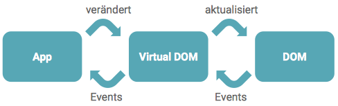
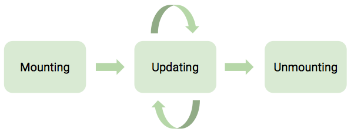
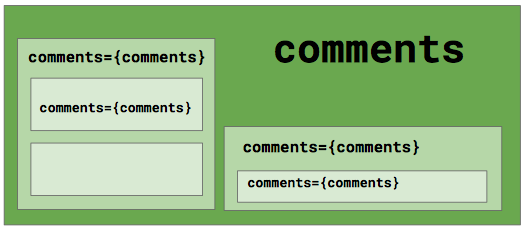
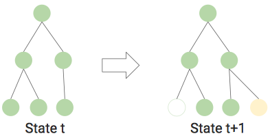
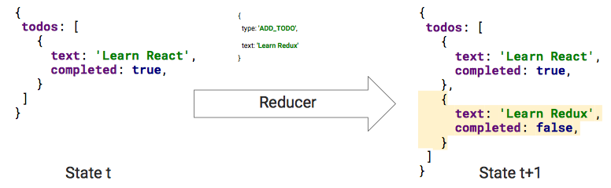
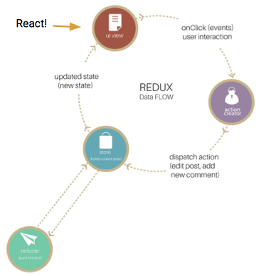

# React

## Goals

Die Teilnehmer können …

* eine React-Applikation mit Benutzerinteraktion erstellen
* die Tools für die React-Entwicklung installieren und benutzen
* den Unterscheid zwischen Props und State erklären
* die Designprinzipien von React erläutern

---

* den Lebenszyklus von React Komponenten und können entscheiden, welche Aufgaben in welchem Schritt erledigt werden sollen
* wissen, wann eine React Klassenkomponente eingesetzt werden sollte
* den Unterschied zwischen Präsentations- und Containerkomponenten erklären
* den Zustand einer umfangreichen App mit Redux verwalten und wissen, wann sich der Einsatz von Redux lohnt

## Prinzipien

* Komplexes Problem aufteilen in einfache Komponenten
* Für bessere
  * Wiederverwendbarkeit
  * Erweiterbarkeit
  * Wartbarkeit
  * Testbarkeit
  * Aufgabenverteilung im Team
* Funktionale Programmierung
  * Komponenten sind Funktionen von (Attribute, State) => View
  * Komposition statt Vererbung
  * Immutable
  * Minimierung von und expliziter mutable State

## Hello React

```jsx
function HelloMessage(props) {
  return (
    <div>
      Hello {props.name}
    </div>
  )
}
```

### JavaScript XML (JSX)

* React verwendet JSX, ein Präprozessor der JavaScript XML ergänzt
  * Kann an beliebiger Stelle im Code auftreten

```jsx
const menu = entries.map(({title, subtitle, path}) => 
  <ListItem as={Link} to={`/${path}`}>
    <h1>{title.toUpperCase()}</h1>
    {subtitle}
  </ListItem>
)
```

### Einschränkungen

* React-Elemente muussen mit Grossbuchstaben anfangen
* JavaScript-Keywords können nicht verwendet werden

```jsx
function Container(props) {
  return <div className="container">{props.children}</div>
}
```

```jsx
const App = () => {
  <Container>
    <HelloMessage name="HSR" />
  </Container>
}
```

### JSX Styles

```jsx
function Container(props) {
  const style = {
    display: 'flex';
    width: '100%',
    minHeight: 300
  }
  
  return <div style={style}>{props.children}</div>
}
```

### JSX Conditionals

* Was zu `null`, `true`, `false` oder `undefined` evaluiert, wird nicht ausgegeben

```jsx
<Container>
  { error &&
    <Message>Fehler: {error}</Message>
  }
</Container>
```

oder

```jsx
<Container>
  { error
    ? <span>Fehler: {error}</span>
    : <span>OK!</span>
  }
</Container>
```

### JSX Desugaring

* JSX wird vom Präprozessor zu React.createElement Aufrufen gewandelt
* React muss deshalb immer importiert werden, wenn JSX verwendet wird

```jsx
import React from 'react';

function Container(props) {
  return <div className="container">{props.children}</div>
}
```

```jsx
import React form 'react';

function Container(props) {
  return React.createElement(
    div,
    {className: "container"},
    props.children
  )
}
```

### Funktionale- und Klassenkomponenten

```jsx
function HelloMessage(props) {
  return <div>Hellow {props.name}</div>
}
```

ist äquivalent zu

```jsx
class HelloMessage extends React.Component {
  render() {
      return <div>Hello {this.props.name}</div>
  }
}
```

und

```jsx
const HelloMessage = ({name}) => <div>Hello {name}</div>
{/*                    ^^^^ Parameter Objekt Deconstruction */}
```

### Props

* Komponenten erhalten alle Parameter als `props` Objekt
  * Bei Klasse als `this.props`
  * Bei Funktionen als Parameter
* Props sind immer **read-only**!
* Häufig sieht man diese mit dem Rest/Spread-Operator zusammen
  * [object-rest-spread Repetition](http://babeljs.io/blog/2016/11/16/6.19.0)

```jsx
function Container({children, ...props}) {
  return <div className="container" {...props}>{children}</div>
}
```

### Klassenkomponenten

* Komponenten, welche aus Klassen bestehen können (selbstverständlich) noch zusätzliche Methoden enthalten
* Aus React-Sicht haben Klassen noch einen weiteren Vorteil:
  * State
  * Lifecycle-Hooks

### Rendering und Mounting

* Um Komponenten auf einer Website anzuzeigen müssen wir diese mounten
* Dazu benötigen wir die `ReachtDOM.render` Methode

```jsx
import React from 'react';
import ReactDOM from 'react-dom';

ReactDOM.render(
  <App />,
  document.getElementById('root');
)
```

## React State

* Web Applikationen sind selten statisch und nicht interaktiv
* React-Klassenkomponenten können eine veränderbaren Zustand haben
* Beispielapplikation: Zähler
  * Komponenten
  * Event Handling
  * Counter inkrementieren

### Komponenten State

```jsx
class Counter extends React.Component {
  state = {
    counter: 0
  }

  render = () => (
    <div>
      {this.state.counter}
      <button onClick={ ??? }>Increment</button>
    </div>
  )
}
```

### Event Handler

* Um Zustand zu ändern benötigen wir einen Event-Handler
  * `<button onClick={ ??? }`
* React Events erwarten eine Funktion als Parameter
  * `<button onClick={(event) => … }>`
* Oder eine Methode aus der Klasse
  * `increment() { ... }`
  * `<button onClick={this.increment.bind(this)}>`
* Mit Event Handler kann der Zähler nun inkrementiert werden

```javascript
increment() {
  this.setState({counter: this.state.counter + 1})
}
```

* `setState` nimmt das Objekt und merged dieses mit dem existierendem `state`
* Nur angegebene Properties werden dabei überschrieben
* Ist der State vom vorherigen State abhängig, sollte man die folgende Form verwenden

```javascript
increment() {
  this.setState(state => ({counter: state.counter + 1}))
}
```

* State Updates können zusammengefasst werden und [laufen asynchron ab](https://medium.com/javascript-scene/setstate-gate-abc10a9b2d82#.7fm7c34ww)

### Reconciliation

1. React Komponenten werden als virtueller DOM gerendert
2. Wird der `state` geändert, erstellt React einen virtuellen DOM
3. Alter und neuer DOM werden verglichen
4. Erst dann werden geänderte DOM-Knoten im Browser erstellt



[Details](https://facebook.github.io/react/docs/reconciliation.html)

### Regeln für State

Der `state` einer Komponente ist immer private

* Kann aber als Prop an andere Komponente weitergegeben werden
  `<CounterDisplay value={this.state.counter} />`
* Ändert der `state`, wird auch das CounterDisplay aktualisiert
* Auch Event-Handler können als Props an Komponenten weitergegeben werden
  `<MyButton onCustomClick={this.handleClick} />`
* Zustand darf **ausschliesslich** mit `setState` geändert werden
* => Props bevorzugen, nur wenn nötig `state` nehmen
  * Keine von Props abgeleiteten Daten im `state` speichern

## Forms

### Example

```jsx
class SignupForm extends React.Component {
  render = () => {
  	<form>
      <div>
        <label>Username</label>
        <input value={this.state.username} type="text" />
      </div>
      <div>
        <label>Password</label>
        <input value={this.state.password} type="password"
      </div>
      <div>
        <button type="submit">Login</button>
      </div>
    </form>
  }
}
```

### Input Handling

* Event Handler bei den Inputs registrieren und Zustand ändern
* Jede Eingabe des Benutzers wird nun unmittelbar im `state` abgelegt und über den `value` dargestellt

```jsx
<input value={this.state.username} onChange={this.handleUsernameChange} ... />
{/*                                          ^^^^ Kein bind nötig, da Lambda
                                                  eigenes this bindet */}
```

```javascript
handleUsernameChange = (event) => {
  this.setState({username: event.target.value})
}
```

### Form Submission

* Soll das Formular per PUT/POST and den Server geschickt werden, muss man nichts weiter tun
* In einer SPA wird man das Formular per Ajax-Call absetzen

```jsx
<form onSubmit={this.handleSubmit}> ... </form>

handleSubmit = (event) => {
  event.preventDefault() // Wichtig, sonst schickt der Browser das Form ab
}
```

### Summary

* **State** ist explizit vorhanden und muss von der Komponente gemanaged werden
* **Events** gleichen den bekannten aus JavaScript
  * Sind aber Wrapper um die Browser-Events um ein gleiches Verhalten in allen Browsern zu haben
  * [Details](https://facebook.github.io/react/docs/events.html)

## Typechecking mit Flow

* Als JS-Library ist React natürlich nicht statisch typisiert
  * Alternativ könnte auch Typescript oder Scala.js verwendet werden
* Oder Flow:

```typescript
function add(num1: number, num2: number) {
  return num1 + num2;
}
const x = add(3, '0');
```

```
add(3, '0')
       ^^^ string. This type is incompatible with the exptected param type of
function add(num1: number, num2: number)
                                 ^^^^^^ number
```

* Flow ist ein Typechecker
  * Typ-Annotation im Code Typ-Inferenz für lokale Definitionen
  * Generics, Maybe-Types, Union and Intersection-Types, Disjoint Unions
  * Sogenanntes Flow-Typing:

``` javascript
function length(x) {
  return x.length;
}

// Was könnte schief gehen?
```

* Es könnte `null` als Argument übergeben werden

``` javascript
function length(x) {
  if (x !== null) {
    return x.length
  } else {
    return 0;
  }
}
```

* Nach dem Null-Check weiss Flow, dass `x` sicher nicht null ist und berücksichtigt das im weiteren Verlauf. Flow Typing!

```typescript
type Action = { type: 'TOGGLE_USER_ADMIN_REQUEST' } |
              { type: 'TOGGLE_USER_ADMIN_SUCCESS', userId: number }

function handleAction(action: Action) {
  switch (action.type) {
    case 'TOGGLE_USER_ADMIN_REQUEST': {
      console.log(action.userId);
                      // ^^^^^^ property 'userId' not found in object type 'action'
      break;
    }
    case 'TOGGLE_USER_ADMIN_SUCCESS': {
      console.log(action.userId);
      break;
    }
  }
}
```

## Recap

### Quiz

This React example is bad and buggy. Can you see why?

``` jsx
class NameLabel extends Component {
  constructor(props) {
    this.state = {
        fullName: props.firstName + ' ' + props.lastName
    };
  }
  
  render() {
    return (
      <h1>Hello, {this.state.fullName}</h1>
    );
  }
}
```

* Constructor wird nur 1 mal aufgerufen
* Wenn sich props ändern, ändert sich der state nicht, weil constructor nur einmal aufgerufen wird
* Ganze Propagierung funktioniert nicht

### Key

* Elemente in einemArray brauchen einen Key, damit bei der Positionsänderung in der Liste das bestehende Element wiederverwendet wird
* Array-Index löst das Problem, aber für die Performance ist eine echte ID besser
  * Index: Beim verschieben eines Elementes wird ganzes Array neu gerendert
  * Key: Besser ID, denn so können die Elemente, welche sich ändern besser identifiziert werden

## Komponenten Lifecycle

### Example: Clock

``` jsx
class Clock extends React.Component {
  state = {
    date: new Date()
  }
}

render() {
  return (
    <div>
      <h2>It is {this.state.date.toLocaleTimeString()}.</h2>
    </div>
  )
}
```

- Wie kann die Uhr jede Sekunde aktualisiert werden?
- Timer starten:

``` javascript
this.timerID = setInterval(
  this.tick,
  1000
)
clearInterval(this.timerID)
```

* Wie und wann stoppen, wenn Komponente nicht mehr angezeigt wird?

### Lifecycles

* React Klassen-Komponenten haben Lifecycle-Methoden
* Können in 3 Phasen unterteilt werden



### Mounting

1. `constructor(props)`
   - State initialisieren
2. `componentWillMount()`
   - Stattdessen Konstruktor verwenden
3. `render()`
4. `componentDidMount()`
   - DOM ist aufgebaut
   - Guter Punkt, um zum Beispiel Remote-Daten zu laden
   - `setState` Aufruf führt zu re-rendering

### Updating

1. `componentWillReceiveProps(nextProps)`
   - Vorschau auf die nächsten Props
   - Davon abhängigen State hier aktualisieren
2. `shouldComponentUpdate(nextProps, nextState)`
   - wird false zurückgeben, wird render übersprungen
3. `componentWillUpdate(nextProps, nextState)`
4. `render()`
5. `componentDidUpdate(prevProps, prevState)`
   - Analog zu `componentDidMount()`, DOM ist aktualisiert

### Unmouting

1. componentWillUnmount()
   - Aufräumen

### Example: Clock

* Start des Timers in `componentDidMount()`
* Stop des Timers in `componentWillUnmount()`

``` javascript
componentDidMount() {
  this.timerID = setInterval(
  	this.tick,
    1000
  )
}

componentWillUnmount() {
  clearInterval(this.timerId)
}
```

[Demo](https://jsfiddle.net/mn6a08u2/1/)

### Struktur und Aufbau einer React App

* Benötigt State oder Lifecycle?
  * Ja: Klasse
    `class HelloMessage extends React.Component`
  * Nein: Funktion
    `function HelloMessage(props)`

### Rollen von Komponenten

Best Practice in der React Entwicklung ist die Trennung zwischen sogenannten Container-Komponenten und einfachen Präsentations-Komponenten

``` jsx
class CommentList extends React.Component {
  constructor() {
      this.state = { comments: [] }
  }
  
  componentDidMount() {
    fetch('/comments').then(response =>
      response.json().then(comments => this.setState({comments}))
    )
  }
  
  render = () => <ul>{this.state.comments.map(renderComment)}</ul>
  
  renderComment = ({body, author}) => <li>{body} --{author}</li>
}
```

### Präsentations Komponenten

Extrahieren einer Komponente die sich nur um die Darstellung kümmert:

```jsx
function CommentList({comments}) {
  const renderComment = ({body, author}) => {
    <li>{body} --{author}</li>
  }

  return <ul>{comments.map(renderComment)}</ul>
}
```

* `CommentList` ist wiederverwendbar und einfacher
* Code is viel lesbarer
* Lässt sich einfach in Isolation testen

```jsx
<Statistic value="5,500" label="Downloads" />
{/*                 vs                     */}
<div class="ui statistic">
  <div class="value">5,500</div>
  <div class="label">Downloads</div>
</div>
```

### Container Komponenten

```jsx
class CommentListContainer extends React.Component {
  state = {
    comments: []
  }

  componentDidMount() {
    fetch('/comments').then(response =>
      respon.json().then(comments =>
        this.setState({comments});
      )
    )
  }

  render = () => <CommentList comments={this.state.comments} />
}
```

### Recap

* Skaliert dieser Ansatz?
  * Daten immer mitzugeben ist mühsam
  * Zustand ist über die ganze Applikation verteilt
  * Calls zum Backend sind überall verteilt
* Zum Beispiel
  * Aktueller User (falls überhaupt)
  * JWT-Token

## Redux

### Wem gehört der Zustand der Applikation?

* Be React: Zustand ist über Komponenten verteilt
* Brauchen mehrere Komponenten dieselben Daten
  * Zustand in gemeinsamen Parent verschieben
  * Über Props an die Komponenten durchreichen



### Redux: Predictable State Container

* Library für State Management
  * Repräsentation des States
  * Veränderungen des States
  * Benachrichtigungen bei Änderungen
* redux.js.org
  * kleine Library (2KB)
  * Nicht React spezifisch

### State

* State wird als Tree von Objekten dargestellt
  * Ein Tree für den gesamten State der Applikation!
  * *Single Source of Truth*
* Tree ist immutable
  * Veränderungen am Tree führen zu einem neuen Tree
  * Funktionale Programmierung
* State wird im sogenannten **Store** verwaltet



### Redux Actions

* Um eine Stateänderung zu machen brauchen wir eine **Action**
  * Action wird an den Store gesendet/dispatched
  * Action ist eine reine Beschreibung der Aktion
    `{ type: 'ADD_TODO', text: 'Learn React' }`

### Redux Reducer

* Der Store benutzt sogenannte Reducer-Funktionen um den State `t+1` zu erstellen
  `(state: State, action: Action): State`



### Redux State

* Reducer erstellt einen neuen State Tree aufgrund der Action (siehe zwei Grafiken weiter oben)

### Redux Reducer-Funktionen

`(state: State, action: Action): State`

```javascript
function todos(state = [], action) {
  switch(action.type) {
    case 'ADD_TODO':
      return [
        ...state, // Neues Array mit zusätzlichen Elementen
        { text: action.text, completed: false }
      ]
    default:
      // Andere actions interessieren diesen Reducer nicht
      return state
  }
}
```

### Reducer kombinieren

* Reducer ist immer nur für einen Teil (Slice) des State-Tress zuständig

  * Im Beispiel: `todos` Array

* Zusätzlicher State hat einen eigenen Reducer

  * Beispiel: State für Todo-Filter

    ```javascript
    {
      todos: [ /* ... */ ],
      filter: 'SHOW_COMPLETED'
    }
    ```

  * Reducer für diesen Teil des States

    ``` javascript
    function filter(state = 'SHOW_All', action) { }
    ```

* Mehrere Reducer werden dann zu einem Root-Reducer kombiniert

``` javascript
function rootRedurcer(state = {}, action) {
  return {
    todos: todos(state.todos, action),
    filter: filter(state.filter, action)
  }
}
```

* Initialer State für die App ist ein leeres Objekt
* Jeder Reducer erhält nur den Teil des States für den er zuständig ist
* Resultat wird zu einem neuen State-Objekt kombiniert

### Redux Datenfluss



### React + Redux

* Redux hat keine React-Abhängigkeit
* React Container-Komponenten müssen:
  * Zugriff auf den Redux-State haben
    * Mapping von Redux-State nach React-Props
  * Actions an den Redux-Store dispatchen können

### Redux mit React verbinden

* Wie kommt React an die Daten aus dem Store?
* Die React-Redux Library bietet dafür eine Funktion:

``` javascript
connect(
  mapStateToProps: (state) => props,
  mapDispatchToProps: (dispatch) => props
)(TodoListComponent)
```

* `mapStateToProps` und `mapDispatchToProps` sind eigene Funktionen
  * `mapStateToProps` erhält State und kann daraus Props ableiten
  * `mapDispatchToProps` erhält einen Dispatcher und leitet auch Props ab

### mapStateToProps

* für die Komponente benötigte Props aus dem State-Tree auslesen
* Properties des Rückgabeobjekts werden der React Komponente von der connect-Methode als Props gesetzt

``` javascript
const mapStateToProps = (state) => {
  return {
    todos: getVisibleTodos(state.todos, state.filter)
  }
}
```

### mapDispatchToProps

* Mit der Dispatch Funktion können Actions an den Store dispatched werden
* Properties des Rückgabeobjekts werden der React Komponente als Props gesetzt

```javascript
const mapDispatchToProps = (dispatch) => {
  return {
    onAddTodoClicked: (text) => {
      dispatch({
        type: 'ADD_TODO',
        text
      })
    }
  }
}
```

``` jsx
<Button onClick={() => this.props.onAddTodoClicked(this.state.todo)} />
```

### Connect und der Store

* Das Resultat von `connect` ist eine React Komponente
* Um den Store für `connect` innerhalb der React Komponentenhierarchie verfügbar zu machen, müssen wir diesen unserer Root-Komponente noch mitgeben

```jsx
render(
  <Provider store={store}>
    <App />
  </Provider>,
  document.getElementById('root');
)
```

### Weitere Redux Libraries

* React-Router-Redux für das Routing
* Redux-Thunk um Promises zu dispatchen (für Ajax-Calls)
* Ein paar dutzend weiterführende [Links](https://github.com/markerikson/react-redux-links)
* [Tipps](https://www.robinwieruch.de/tips-to-learn-react-redux/) um React und Redux zu lernen

### Summary Redux

* **Store** enthält einen **State-Tree** mit dem gesamten Zustand der Applikation
* Änderungen werden durch **Actions** beschrieben und dem Store **dispatched**
* mittels **Reducern** erstellt der Store einen neuen State-Tree
* Komponenten werden durch **connect** mit Daten aus dem State-Tree versorgt und bei Änderungen neu gerendert

### Vorteile von Redux

* Bessere Übersicht da Zustand an einer Stelle gehalten wird
  * Zustand kann auch einfacher serialisiert werden!
  * Ermöglicht Server Rendering
* Einfacheres Debugging da Zustandsänderungen explizit
  * Time-Traveling Debugging
  * Chrome Redux Dev-Tools
* Unsere React-Komponenten werden einfacher

### Redux verwenden?

* Soll in jeder React-Applikation Redux eingesetzt werden?
  * **NEIN!**
  * Wenn kaum Zustand existiert der von mehreren Komponenten verwendet wird, lohnt sich der Redux-Overhead nicht
* Nicht jeder Zustand muss in den Redux-Store, Formulardaten oder UI-State (Modal geöffnet, Menu expanded) kann auch in React State gehalten werden

### Server Rendering

* Dank virtuellem DOM kann React auch ohne Browser genutzt werden
* Server Rendering von Komponenten nach HTML
  `renderToString(<App />)`
* Benutzer und Suchmaschinen sehen die Seite sofort
* Redux-State kann mit [serialisiert](http://redux.js.org/docs/recipes/ServerRendering.html) werden